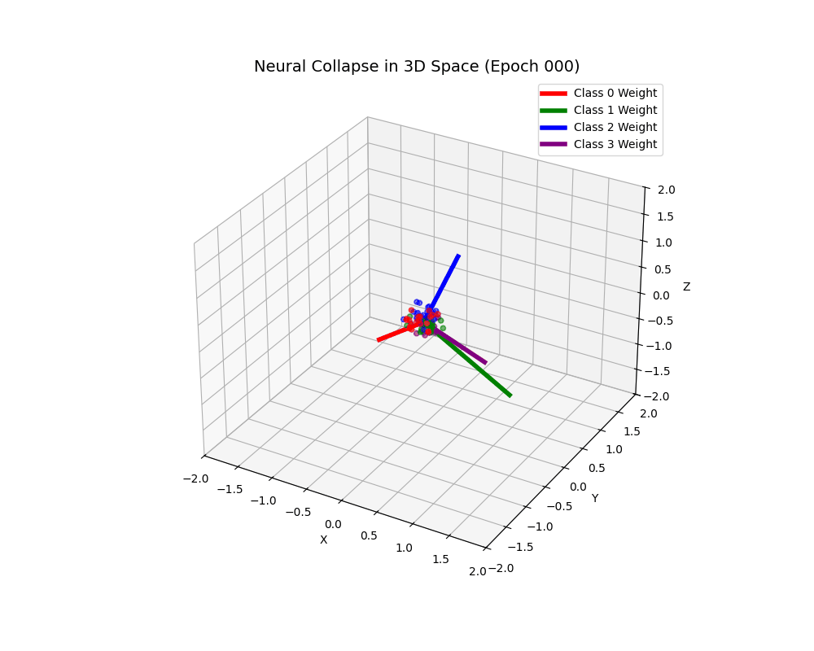
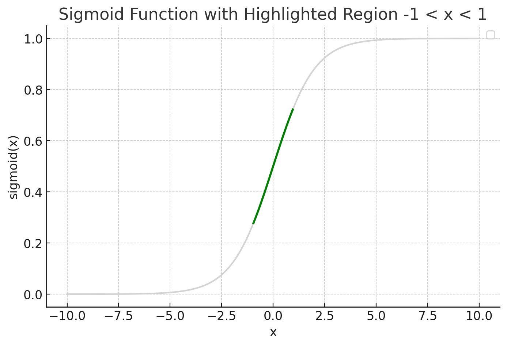
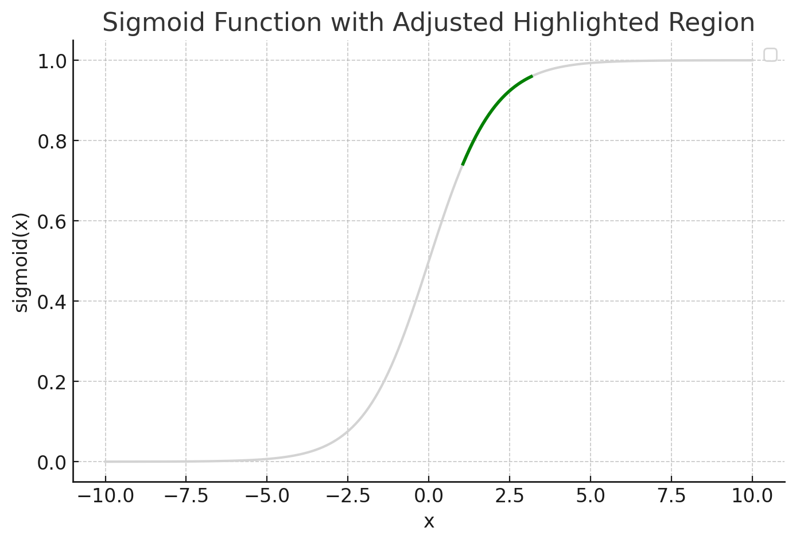
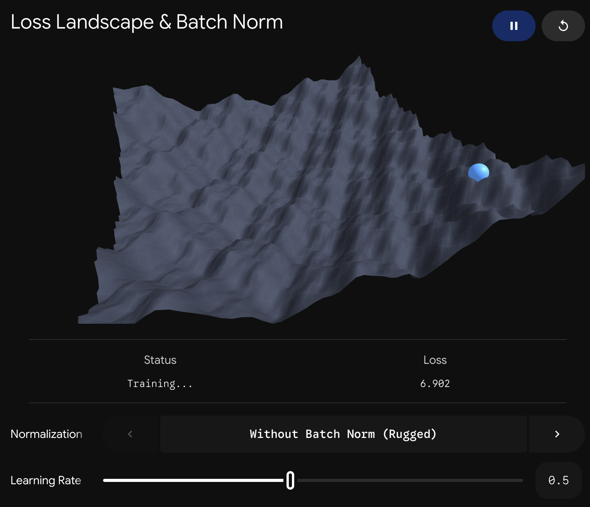
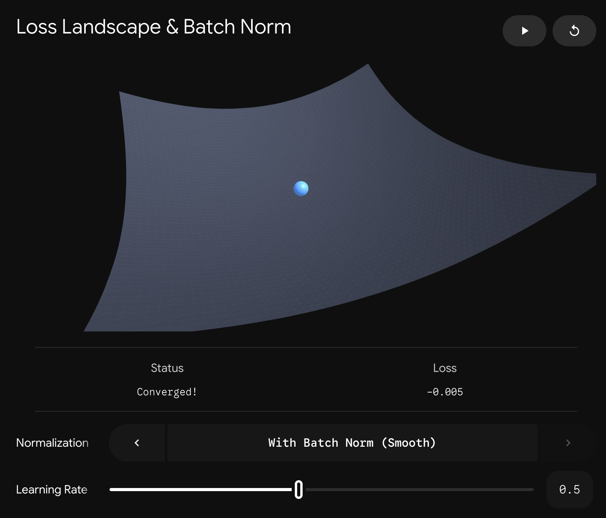

# ノート
## 平均値の求め方
- 悪い例：`acc_train = (pred == labels_train).sum() / len(labels_train)`

    「PyTorchのテンソル÷Pythonの整数」という異種交配の計算が発生している．

- 良い例：`acc_train = (pred == labels_train).float().mean()`

    全てがPyTorchのテンソル演算内で完結している．演算が全てGPUで処理されるため，オーバーヘッドが減る．`float()`は，ブール型を`float32`へ変換している．

## `flatten()`
- `flatten()`：全部つぶして1次元にする．
```python
x.shape # (10, 1, 5)

x.flatten().shape # (50, )
```

## `squeeze()`と`unsqueeze()`
- `squeeze()`：サイズ1の余計な次元だけ消す．
```python
x.shape # (10, 1, 5)

x.squeeze().shape # (10, 5)
```
- `unsqueeze()`：サイズ1の次元を1つ追加する．モデルに入力するデータの次元を調整する時などに使うよ．
```python
x.shape # (30, )

x.unsqueeze(0).shape # (1, 30)
x.unsqueeze(1).shape # (30, 1)
```

## softmax関数に指数関数が使われている理由
$$
y_i = \frac{exp(x_i)}{\sum\limits_{k=1}^{n} exp(x_k)}
$$
- softmax関数の目的：スコアを確率に変換したい，かつ，最も有力な候補をはっきり選びたい．
- 直感的な疑問：確率を求めるなら，スコア$x_i$をスコアの総和で割ればよいのではないか？
- スコアを指数関数に通す理由：
    - スコアは負の値を取る事があり，スコア$x_i$をスコアの総和で割っても確率$[0, 1]$へ変換できないため．
    - 指数関数$e^x$が正の実数を返す単調増加関数であるため．大小の比率は保たれないが，大小関係は維持される．
    - また，指数関数によって大きい値がより強調されるため，「最も大きいスコアを持つクラス」を際立たせやすい．
- 余談：なのでsoftmaxの世界では，負のスコアたちはかなり厳しい扱いを受けます…．🥲

## PyTorchのCrossEntropyLoss関数がsoftmax関数と対数関数をまとめている理由
予測関数と損失関数の境界がわかりづらくなるのに，指数関数と対数関数をまとめるのには数値計算の観点による動機がある．

予測モデルが自信満々で，あるクラスに対して$x_i = 1000$という大きなロジットを出力したとする．
- softmax関数と対数関数を別々に適用する場合

    softmax関数の内，$e^{1000}$の計算がオーバーフローを起こして無限大（`inf`）となる．
    $$
    y_i = \frac{exp(x_i)}{\sum\limits_{k=1}^{n} exp(x_k)} \approx \frac{\infty}{\infty} = nan
    $$
    この時，交差エントロピー関数の中の対数関数を適用すると，
    $$
    \log(nan) = nan
    $$
    となる．この`nan`が逆伝播全体に伝染して，勾配・重みが`nan`となり学習ができなくなる．
- softmax関数と対数関数をまとめる場合
    
    詳細な式変形は省略するが，"Log-Sum-Exp Trick"を使う．`x_i`から最大値`m`を引く工夫を行う．
    $$
    \begin{align*}
        m = max(x_i) \\
        x_i - m \leq 0 \\
        exp(x_i - m) \in (0, 1]
    \end{align*}
    $$
    定義域が良いので，指数関数でオーバーフローを起こさない．

$x_i = -1000$の場合は，$e^{-1000} \approx 0.0$となる．もし，softmax関数の分母全体も$0.0$になった場合は，softmax関数が不定形で`nan`を吐き，以降の議論は同様．

## 重み行列の添字
通常，重み行列の要素$w_{ij}$は「j番目の入力からi番目の出力への重み」を指す．ニューラルネットの図を想像してね．

## `nn.BCELoss()`と`nn.CrossEntropyLoss()`で渡す正解ラベルの次元が違う理由
どうしてBCELossの正解ラベルを作る時は，わざわざ1次元テンソルを2次元に拡張したのに，CrossEntropyLossの正解ラベルは1次元テンソルじゃないといけない仕様になっているの？
```python
# nn.BCELoss()
inputs_train = torch.tensor(x_train, dtype=torch.float32)
labels_train = torch.tensor(y_train, dtype=torch.float32).view((-1, 1)) # torch.Size([N, 1])

criterion = nn.BCELoss() # 2値交差エントロピー
loss = criterion(outputs, labels_train) # 損失

# nn.CrossEntropyLoss()
inputs_train = torch.tensor(x_train, dtype=torch.float32)
labels_train = torch.tensor(y_train, dtype=torch.long) # torch.Size([N])

criterion = nn.CrossEntropyLoss() # 交差エントロピー
loss = criterion(outputs, labels_train) # 損失
```

- BCELossの数式
    $$ L_{BCE} = -\frac{1}{N} \sum_{i=1}^N \left( y_i \log(\hat{y}_i) + (1 - y_i) \log(1 - \hat{y}_i) \right) $$
    - $N$：サンプル数（バッチサイズ）（スカラー）
    - $y_i$：$i$番目のサンプルの真のラベル（$0$または$1$のスカラー）
    - $\hat{y}_i$：$i$番目のサンプルに対して予測モデルが出した確率（$0$から$1$のスカラー）

- CrossEntropyLossの数式
    $$ L_{CE} = -\frac{1}{N} \sum_{i=1}^N \log\left( \frac{\exp(x_{i, y_i})}{\sum_{j=1}^C \exp(x_{i, j})} \right) $$
    - $C$：クラスの総数（スカラー）
    - $x_{i, j}$：$i$番目のサンプルの$j$番目のクラスに対する予測ロジット（スカラー）
    - $y_i$：$i$番目のサンプルの正解クラスのインデックス（$0$から$C-1$の整数スカラー）

- 回答：BCEとCEでは，正解ラベルの使い方が違うから．
    - BCE：正解ラベル$y_i$は，予測モデルの出力$\hat{y}_i$との積を直接計算される．よって，`labels`と`outputs`では，同じインデックスの要素が同じ意味を持つ必要がある．（例：[N]と[N]，[N, 1]と[N, 1]）次元が不一致な場合，お節介なブロードキャストによって意味の対応がズレる事故が起きる．
    - CE：正解ラベル$y_i$は，$i$番目のサンプル中から正解クラスの出力をピックアップするための「インデックス」として機能する．テンソル演算に参加しない「選択キー」である．ベーシックな学習においては，インデックスに2次元テンソルは冗長であり，1次元テンソルが最適である．（※正解を確率分布として直接教えたい高度なケースに限っては，CEでも2次元の正解ラベルが許容される．）

## numpy.ndarrayとtorch.Tensorの相互変換
### Tensor → NumPy
- `tensor.numpy()`：`requires_grad=False` のときのみ可（`True`ならエラー）
- `tensor.detach().numpy()`：計算グラフから切り離して変換（推奨）
- `tensor.data.numpy()`：使わないで！安全チェック無しで危険！非人道的！

### NumPy → Tensor
- `torch.from_numpy(array)`：メモリ共有（高速・コピーなし）
- `torch.tensor(array)`：コピーして新規作成

### 注意
- `.detach().numpy()` はコピーではなくメモリ共有
- 完全コピーしたい場合：`tensor.detach().numpy().copy()`
- GPUテンソルは：`tensor.cpu().detach().numpy()`

## PyTorchにおけるGPU利用のルール
- テンソル変数は，データがCPU・GPU上のどちらにあるのかを属性として持っている．
- CPUとGPU間でデータを転送する時は，to関数を使う．
- 2つの変数が両方ともGPU上にある場合，演算はGPU上で行われる．
- 変数の片方がCPU，もう一方がGPUの場合，演算はエラーになる．
- 「モデル本体」「入力データ」「正解データ」の3つを送る事をお忘れなきよう．

## 組み込みデータセットの分割とTransform（データ拡張）の罠
- まず，`torchvision.datasets`モジュールの組み込みデータセット（MNISTやCIFAR10など）を使用する時は，引数`train`が存在する．
- `train=False`は，テストデータである．これを検証データとみなすと，テストデータが存在しなくなってしまう．よって，検証データは，`train=True`のデータセットから切り出す必要がある．
- ここで，データ拡張は一般的に学習データにのみ適用し，検証や評価データには含めない事を思い出しておく．検証や評価データのTransformにデータ拡張を混ぜてしまうと，エポックごとにデータ拡張結果が変化してしまい，指標の変化が「モデル性能の変化」に依るものか「入力データの変化」に依るものか区別できなくなってしまう．（※PyTorchのTransformは，データセットの`__getitem__`メソッドによって毎エポック実行される．）
- では，`train=True`のデータセットを訓練データ・検証データに分割してから，それぞれ異なるTransformを適用するだけの話ではないか？
- ところが，`torchvision.datasets`モジュールのインスタンスがTransformを保持するAttribute（クラスの属性）名は，データセット毎に異なる．つまり，`train_set.transform = new_transform`などと書けば，エラーも出ないのにTransformが書き換わらない場合があるという恐ろしい罠が存在する．
    > Manipulating the internal .transform attribute assumes that self.transform is indeed used to apply the transformations. While this might be the case for e.g. MNIST other datasets could use other attributes (e.g. self.image_fransform) and you would need to add this manipulation according to the real implementation (which could of course also change between releases). The right approach is thus to set the transformations once during the initialization of the Dataset and allow the Dataset to handle the transformations internally without depending on its actual implementation. (https://discuss.pytorch.org/t/how-to-apply-another-transform-to-an-existing-dataset/85416/7)
- じゃあどうすればいいのか．解決策は「元のデータセットを2つ作り，それぞれに別々のTransformを適用した上で，同じインデックス配列を使って`Subset`で抽出する」事である．
    ```python
    import torch
    from torchvision import datasets, transforms
    from torch.utils.data import Subset

    # 1. 訓練用と検証用で，元のデータセットを2つ作る．
    train_dataset_full = datasets.CIFAR10(
        root='./data', train=True, download=True, transform=train_transform) # 訓練用フィルタ（データ拡張あり）

    valid_dataset_full = datasets.CIFAR10(
        root='./data', train=True, download=True, transform=test_transform) # 検証用フィルタ（データ拡張なし）

    # 2. 訓練と検証のデータ数を決める．
    train_size = int(len(train_dataset_full) * 0.9)
    valid_size = len(train_dataset_full) - train_size

    # 3. データを分割するための「ランダムなインデックス」を生成
    # torch.randperm(n)：0からn-1までのランダムな整数の順列を返す．
    torch.manual_seed(42)
    indices = torch.randperm(len(train_dataset_full)).tolist()

    # 4. random_splitを使わず，Subsetを使って訓練データ・検証データを分ける．
    train_dataset = Subset(train_dataset_full, indices[:train_size])
    valid_dataset = Subset(valid_dataset_full, indices[train_size:])
    ```
    > My preference would be to create three difference datasets using the desired transformations for the training, validation, and test sets. This approach makes it clear that the train_dataset also uses the train_transform only. Once this is done, create the training, validation, and test indices via any kind of splitting (sklearn.model_selection.train_test_split is quite popular) and wrap the datasets into a Subset with the corresponding indices. (https://discuss.pytorch.org/t/custom-dataset-best-practices-for-transformations-on-training-set/155761/2)
- 「Transformは，最初に固定せよ！」

## nn.ReLU(inplace=True)のinplaceは何のため？
### 結論
`inplace=True`は，中間テンソルを上書きしてメモリを節約するためのオプション．

### inplaceの動き
通常：
```python
a = x * 2
b = a ** 2
```
→ `a`と`b`は，別のメモリに保存される．

inplace：
```python
a = x * 2
a.pow_(2) # aを上書き
```
→ 元の`a`の値が消える．

### 中間テンソルってなんやねん（誤差逆伝播のイメージ）
計算グラフ：
```
x → f → g → h → L (loss)
```

順伝播：
```python
f = x * 2
g = f ** 2
h = g + 1
```

誤差逆伝播法で求めたい：
```
∂L/∂x
```

連鎖律：
```
∂L/∂x
= ∂L/∂g * ∂g/∂x
= ∂L/∂g * ∂g/∂f * ∂f/∂x
```

各項：
```
∂L/∂g = ∂(g + 1)/∂g = 1
∂g/∂f = ∂(f ** 2)/∂f = 2f # ここで中間テンソルfが必要！
∂f/∂x = ∂(x * 2)/∂x = 2
```
中間テンソルfは，いつの値？

→ 学習ループ中に，今のパラメータ・今の入力を使ってforwardした時の中間テンソル！

→ だから中間テンソルをキャッシュしておかなければならない．

### ReLUで`inplace=True`がOKな理由
ReLU：
```
y = max(0, x)
```

微分：
```
1 (x > 0)
0 (x ≤ 0)
```

- x > 0 ⇔ y > 0
- x ≤ 0 ⇔ y = 0

**出力yを見れば判定できる．**

### まとめ
- 中間テンソルは「逆伝播のための記録」
- 勾配は「そのときの forward に対するもの」
- inplace はその記録を壊す可能性がある
- ただし ReLU は例外的に安全

## CNNモデル
### 畳み込み層のカーネルの画素数を奇数にする理由
1.  偶数だと，入力のi+0.5（またはi-0.5）ピクセル目を重心とする情報が，出力のiピクセル目に移され，画像の情報がドリフトしてしまうから．
    - 別にドリフトしても良くね？
    
        画像分類タスクなら大きな影響は無いかもしれない．しかし，セグメンテーションや物体検出などでは，入力の座標と出力の座標が完全に一致していなければならない．「出力座標のiピクセル目に歩行者がいるよ．」と言って，それが入力座標のiから10ピクセルずれていたら，自動運転車は交通事故を起こす．
    - ドリフトの具体的イメージ

        ```python
        import torch
        import torch.nn as nn

        # 長さ10の1次元画像．インデックス5に「歩行者（1.0）」がいる
        x = torch.zeros(1, 1, 10)
        x[0, 0, 5] = 1.0 

        # 【奇数カーネル (3)】：左右対称な重み（平均化）
        conv_odd = nn.Conv1d(1, 1, kernel_size=3, padding=1, bias=False)
        conv_odd.weight.data = torch.tensor([[[1/3, 1/3, 1/3]]]) # 均等な重み

        # 【偶数カーネル (2)】：左右対称な重み（平均化）
        conv_even = nn.Conv1d(1, 1, kernel_size=2, padding=1, bias=False)
        conv_even.weight.data = torch.tensor([[[1/2, 1/2]]]) # 均等な重み

        # 伝言ゲーム（20層連続で通過させるシミュレーション）
        out_odd = x.clone()
        out_even = x.clone()

        # ※偶数の場合はサイズ維持のため，右側の余分なパディングを削る処理を手動で挟む
        for _ in range(20):
            out_odd = conv_odd(out_odd)
            out_even = conv_even(out_even)[..., :-1] # サイズ維持のための苦肉の策

        print(f"奇数(K=3)通過後のピーク位置: {torch.argmax(out_odd).item()}") # 出力: 元の位置から1ミリも動いていない！
        print(out_odd.detach().numpy())
        print(out_odd.shape)
        print()

        print(f"偶数(K=2)通過後のピーク位置: {torch.argmax(out_even).item()}") # 出力: 配列の端に追いやられて消滅する（完全にズレる！）
        print(out_even.detach().numpy())
        print(out_even.shape)
        print()

        """
        奇数(K=3)通過後のピーク位置: 5
        [[[0.02570434 0.0504282  0.07277296 0.09079538 0.10229285 0.1053796
           0.09907098 0.08360145 0.06036919 0.03160813]]]
        torch.Size([1, 1, 10])

        偶数(K=2)通過後のピーク位置: 9
        [[[0.0000000e+00 0.0000000e+00 0.0000000e+00 0.0000000e+00 0.0000000e+00
           9.5367432e-07 1.9073486e-05 1.8119812e-04 1.0871887e-03 4.6205521e-03]]]
        torch.Size([1, 1, 10])
        """
        ```

2.  偶数だと，入力のサイズを維持するためのパディングが非対称になってしまい，PyTorchで実装するのが面倒になるため．

### プーリング層
- プーリング層の役割：

    「局所領域内の値の要約」と「ダウンサンプリング」の2つを順に行う事．元信号に高い周波数の成分が含まれる時，不十分なサンプリングレートでダウンサンプリングすると，本来存在しない偽信号が生じるエイリアシングが発生する．エイリアシングの主な対策は，「ナイキスト周波数を超える高周波成分をカットしてしまう事」である．「局所領域内の値の要約」は，入力信号の高周波成分を除去するローパスフィルタを役割を果たし，「ダウンサンプリング」におけるエイリアシングを防いでいる．

- そもそもダウンサンプリングをしなきゃいけない理由：
    - 受容野（Receptive Field）の拡大：ネットワークの深い層にある1つのピクセルが，元の入力画像の「どれくらい広い範囲（森）」を見ているかを示す指標．空間を圧縮せずに畳み込みを続けると局所的な特徴しか捉えられないが，ダウンサンプリングを行うことで，少ない層数で画像全体のコンテキスト（意味）を捉えられるようになる．
    - 計算リソースの節約と高次元化：空間解像度（縦・横）を圧縮し，浮いたメモリ容量を使って特徴量の数（チャンネル数）を増やす．これにより，「物理的な位置情報」から「意味的な特徴情報」への変換を効率的に行うため．

- プーリング方法の選び方：
    - 最大プーリング（Max Pooling）：
        - 局所領域の最大値をとる．畳み込み（画像パッチとカーネルの内積）で得られた「最も強い特徴」だけを次へ伝える．
        - メリット：特徴が数ピクセルずれても出力が変わらない「移動不変性（Translation Invariance）」を獲得できる．画像認識の序盤〜中盤で「どこにあるか」より「何があるか（エッジやパーツの存在）」を際立たせたい時に選ぶ．
        - 余談：カーネルはなぜ「見つけたい特徴」と同じ形に育つのか？

            CNNの学習において，カーネル（重み）は無数のエポックを経た後，探したい画像パターンと全く同じ形に変形していく．正確に言えば，「正例（役に立つパッチ）に対しては内積が最大化され，負例（役立たずのノイズ）に対しては内積が最小化されるように」カーネルの向きが最適化される．なぜそんな魔法のようなことが起きるのか？

            それは，勾配降下法における更新式が，結果的に「入力画像パッチが $\mathbf{x}$ の時，損失の微分が負なら，$\mathbf{x}$ そのものをカーネルに**足す**」「微分が正なら，$\mathbf{x}$ をカーネルから**引く**」というベクトル合成の挙動をするからだ．

            つまり直感的には，ランダムだったカーネル $\mathbf{w}$ は無数の更新を経た後，以下のようなベクトルの線形結合に化ける．
            $$ \mathbf{w} \approx \sum (\text{役に立つ画像パッチ}) - \sum (\text{役立たずの画像パッチ}) $$

            より数学的に厳密に証明しよう．勾配降下法の場合，
            $T$ 回のパラメータ更新を行った後のカーネル $\mathbf{w}^{(T)}$ は，初期状態 $\mathbf{w}^{(0)}$ から微小な更新を $T$ 回分蓄積したものとして，以下のように展開できる．

            $$
            \begin{align*}
                \mathbf{w}^{(T)} &= \mathbf{w}^{(0)} - \sum_{t=1}^{T} \left( \eta \frac{\partial L^{(t)}}{\partial \mathbf{w}^{(t)}} \right) \\
                &= \mathbf{w}^{(0)} - \sum_{t=1}^{T} \left( \eta \frac{\partial L^{(t)}}{\partial y^{(t)}} \frac{\partial y^{(t)}}{\partial \mathbf{w}^{(t)}} \right) \\
                &= \mathbf{w}^{(0)} - \sum_{t=1}^{T} \left( \eta \frac{\partial L^{(t)}}{\partial y^{(t)}} \frac{\partial (\mathbf{w}^{(t)} \cdot \mathbf{x}^{(t)})}{\partial \mathbf{w}^{(t)}} \right) \\
                &= \mathbf{w}^{(0)} - \sum_{t=1}^{T} \left( \eta \frac{\partial L^{(t)}}{\partial y^{(t)}} \mathbf{x}^{(t)} \right)
            \end{align*}
            $$

            【記号の定義とShape】
            - $\mathbf{w}^{(t)}$：ステップ $t$ におけるカーネル（重み）ベクトル．Shape: $(K^2, 1)$
            - $\mathbf{w}^{(0)}$：初期化されたランダムなカーネル．
            - $\eta$：学習率（正のスカラー定数）．
            - $L^{(t)}$：ステップ $t$ における損失（スカラー）．
            - $y^{(t)}$：内積による予測スコア（スカラー）．
            - $\mathbf{x}^{(t)}$：ステップ $t$ で入力された画像パッチのベクトル．Shape: $(K^2, 1)$

            ここで最も重要なのが，スカラー係数となる $\frac{\partial L}{\partial y}$ （予測誤差）の符号である．

            - 「役に立つ（正例）」＝ $\frac{\partial L}{\partial y} < 0$ となる．
                予測スコアが足りていないため，マイナスが掛かって結果的に $\mathbf{x}$ が $\mathbf{w}$ に**足し算**される．
            - 「役立たず（負例）」＝ $\frac{\partial L}{\partial y} > 0$ となる．
                過剰反応してしまっているため，プラスが掛かって結果的に $\mathbf{x}$ が $\mathbf{w}$ から**引き算**される．

            【直感的な例え：モンタージュ写真】
            警察が「犯人のモンタージュ写真」を作るシーンを想像するとわかりやすい．
            - 初期状態：最初は，白紙に適当な線を引いたようなデタラメな似顔絵（$\mathbf{w}^{(0)}$）を持っている．
            - 正例（目撃情報）：「犯人はこんな目をしていました！」という写真 $\mathbf{x}$ が来た．損失関数は「似顔絵にこの特徴を足せ（微分が負）」と指示する．似顔絵にその目を書き足す（ベクトル加算）．
            - 負例（無関係な人）：「この人は無実の一般人です」という写真 $\mathbf{x}$ が来た．損失関数は「似顔絵からこの特徴を引け（微分が正）」と指示する．似顔絵から，一般人と共通する特徴を消しゴムで消す（ベクトル減算）．

            これを何万枚もの写真で繰り返すと，デタラメだった似顔絵は「無実の人々の特徴が削ぎ落とされ，犯人の特徴だけが塗り重ねられた，完璧なモンタージュ写真」に化ける．これが，ニューラルネットワーク（ここでは畳み込み層）が特徴を「学習」するメカニズムの正体だ．

    - 平均プーリング（Average Pooling）：
        - 局所領域の平均（期待値）をとる．
        - メリット：情報を尖らせず，全体的な傾向を要約する．現代では，ネットワークの最終層で空間情報を一気に1ピクセルに潰す「Global Average Pooling (GAP)」として使われ，「画像全体としてその特徴がどれくらい含まれるか」の期待値を算出するために選ばれる．

    - 【発展】ストライド畳み込み（Strided Convolution）：
        - 現代の最先端モデルにおける第3の選択肢．プーリング層を使わず，畳み込み層のストライド$s$（歩幅）を$s>1$に設定することで空間を圧縮する．
        - メリット：プーリングのような「固定の圧縮ルール」ではなく，「どう圧縮すれば損失が最小になるか」というダウンサンプリングの方法自体をネットワークに学習させることができるため，表現力が高い．

## テンソルの第0次元（一般にバッチサイズ）を取得する方法
1.  `len(inputs)`：Python標準
2.  `inputs.shape[0]`：NumPy由来
3.  `inputs.size(0)`：PyTorchネイティブ（NumPyとの区別のためにコレを使おうね．）

## `torchvision.transforms.Normalize(μ, σ)`の使い方
- 役割：入力を「平均0・分散1」に近づける事
- 式：$X = (x - \mu) / \sigma$

### よくある設定
- `Normalize(0.5, 0.5)`
  - `[0, 1] → [-1, 1]` にスケーリング
  - 手軽なので練習で使用

### 本来の方法
- データセットの平均・標準偏差を使う（より正確）
  - 例：MNIST → $mean\approx 0.13,\quad std\approx 0.31$

### 使い分け
- 練習：`0.5, 0.5` でOK
- 実務：実データから計算

## 分類器に隠れ層は必要なのか？
- 疑問の背景：

    参考書のCNNモデルでは分類器（全結合層）に隠れ層とReLUが使われていた．しかし，「分類器はすでにCNNが抽出した”特徴ベクトル”を受け取るのだから，分類器自体が複雑な関数近似（非線形変換）をする必要は無いのではないか？」という疑問が生じた．

- 結論：

    その直感は，最先端のアーキテクチャ（ResNet以降）においては正しい．しかし，参考書のような一昔前のCNN設計（VGGなど）においては不正解（隠れ層が必要）となる．

- なぜ一昔前のCNNには隠れ層が必要だったのか？（未整理な証拠）

    参考書の設計では，プーリング後の空間情報（例：$32 \text{ch} \times 14 \times 14$）を`Flatten`でそのまま1列に並べて分類器に渡している．これはピクセル単位の位置情報が複雑に絡み合った「非線形」な状態（線形分離不可能）であるため，分類器側で隠れ層（MLP）を用いて証拠を整理し，無理やり線形分離可能な状態へと関数近似する必要がある．

- 現代のCNNに隠れ層が不要な理由（完璧な証拠）

    現代のモデルでは，分類器の手前で`Flatten`の代わりに「Global Average Pooling（GAP）」を行う．これにより空間情報を完全に潰し，純粋な「意味の強さ（チャンネルごとの期待値）」だけを抽出する．CNN側が情報を「完全に線形分離可能な特徴ベクトル」まで磨き上げるため，分類器は複雑な関数近似を放棄し，1層の線形変換（`nn.Linear(n_input, n_output)`）だけで済む．

- 数式と確率統計の視点：
    - 線形分離不可能な場合（隠れ層あり）：$\mathbf{z} = \max(\mathbf{0}, \mathbf{W}_1\mathbf{x} + \mathbf{b}_1)$ のように，非線形な活性化関数で空間を折り曲げる必要がある．
    - 線形分離可能な場合（隠れ層なし）：$\mathbf{y} = \mathbf{W}\mathbf{x} + \mathbf{b}$ だけで，各クラスの事後確率 $P(Y|\mathbf{x})$ を直接モデリングできる．分類器に関数近似が必要なのは，単に「CNN側の特徴抽出能力が甘いから」に過ぎない．

- 【おまけ】GAPによる過学習の抑制：

    隠れ層を持つ全結合層は，ネットワーク全体のパラメータ（重み）の大部分を占めてしまうため，訓練データを丸暗記する「過学習」の最大の原因となっていた．隠れ層を撤廃しGAPを採用することは，関数近似を省くだけでなく，パラメータ数を劇的に削減し，未知のデータへの対応力（汎化性能）を向上させるための極めて合理的な設計戦略である．（参考文献：Lin, M., Chen, Q. and Yan, S.: Network In Network, *Proc. International Conference on Learning Representations* (*ICLR 2014*) (2014).）

## 線形分離可能とはどういう意味なのか？
- 直感的な定義

    空間上に散らばっている異なるクラス（例：感染あり／なし，犬／猫）のデータ群を，「1本の真っ直ぐな直線（3次元以上なら超平面）」だけで，完全に綺麗に分けられる状態のこと．

- 境界線の数学的性質（※前提：分類器（全結合層）が非線形関数を持たない場合）

    この時，分類器が引く境界線はどこまでいっても「直線」である．多値分類において，クラス $A$ とクラス $B$ の境界線はスコアが等しい位置であり，以下の数式で表される．
    $$\mathbf{w}_A \cdot \mathbf{x} = \mathbf{w}_B \cdot \mathbf{x}$$
    $$(\mathbf{w}_A - \mathbf{w}_B) \cdot \mathbf{x} = 0$$
    これは，差分ベクトル $(\mathbf{w}_A - \mathbf{w}_B)$ を法線とする真っ直ぐな超平面の式である．

- 多値分類の全体像とAND演算（ボロノイ分割みたいなイメージ）

    隠れ層なしの分類器において，クラスが3つ以上ある場合でも全体の境界線は「曲線」にはならない．あるクラス $k$ が勝者となる領域 $R_k$ は，以下の数式で表される．
    $$R_k = \bigcap_{j \neq k} \{ \mathbf{x} \mid (\mathbf{w}_k - \mathbf{w}_j) \cdot \mathbf{x} > 0 \}$$
    他クラスとの1対1の対決で勝利する領域（半空間）を求め，それらを $\bigcap$（論理積：AND）で重ね合わせてハサミで切り出すという幾何学的な操作を表している．結果として，分類空間全体は直線の切れ端で囲まれたボロノイ図（凸多面体の集合）のような空間となる．

- 分類器が隠れ層（非線形関数）を持つ場合の例外（境界線の湾曲）

    参考書の古いCNNのように，分類器に隠れ層と非線形な活性化関数（ReLUなど）が含まれている場合，特徴空間 $\mathbf{x}$ から見た境界線は「真っ直ぐな直線」ではなくなり，空間を歪めて引かれる複雑な曲線（なみなみ・ジグザグ）になる．隠れ層とは，複雑に絡み合った線形分離不可能なデータに対して，無理やり曲がった境界線を引くための普遍性定理に基づく「関数近似」装置である．

- 深層学習（CNN）における真の目的

    現実の生の画像データ等は，多次元空間の中で複雑に入り乱れており直線では分割できない．CNNの深い層が行っているのは，この絡み合ったデータを解きほぐすことである．現代のCNNでは分類器の隠れ層（なみなみの境界線）を過学習の原因として破棄し，最終層（GAP）を通過した時点で，データが「最後に直線を1本引くだけでスパーンと分割できる状態（線形分離可能な空間）」へと写像されるようにネットワーク全体を最適化する．これが「良い特徴表現を獲得した」という事象の数学的な正体である．

## 損失関数の勾配に従ってパラメータを更新すると線形分離可能な特徴空間が幻出する理由
- $x$ と $w$ のペアに働く引力と斥力

    誤差逆伝播法において，損失関数の勾配は分類器の重み $\mathbf{w}$（クラスの代表ベクトル）と，CNNが出力する特徴ベクトル $\mathbf{x}$ の両方に同時に働く．
  
    - 引力と斥力の導出

        出力スコア（ロジット）を $z_k = \mathbf{w}_k \cdot \mathbf{x}$ とし，ソフトマックス関数を通した予測確率を $y_k$ とする．正解クラスを $c$ としたとき，多クラス交差エントロピー損失 $L$ のスコア $z_k$ に対する偏微分（予測誤差）は，以下のように計算される．
        $$\frac{\partial L}{\partial z_k} = y_k - t_k \quad \text{($t_k$ は正解なら1，不正解なら0)}$$
        これにより，正解クラスの誤差は $(y_c - 1) < 0$（負），不正解クラスの誤差は $y_j > 0$（正）となる．これを連鎖律に当てはめると，勾配降下法における更新方向（勾配にマイナスを掛けたもの）は次のように導出される．

    1. 正解クラスの重み $\mathbf{w}_c$ にかかる引力（$w_c \to x$）

        $$-\frac{\partial L}{\partial \mathbf{w}_c} = - \frac{\partial L}{\partial z_c} \frac{\partial z_c}{\partial \mathbf{w}_c} = -(y_c - 1)\mathbf{x} = \underbrace{(1 - y_c)\mathbf{x}}_{\text{引力（足し算）}}$$
        係数 $(1 - y_c)$ は必ずプラスになるため，正解クラスの重み $\mathbf{w}_c$ には，特徴ベクトル $\mathbf{x}$ が直接足し込まれ，両者は引き寄せられる．
    
    2. 不正解クラスの重み $\mathbf{w}_{j\neq c}$ にかかる斥力（$w_j \to -x$）

        $$-\frac{\partial L}{\partial \mathbf{w}_j} = - \frac{\partial L}{\partial z_j} \frac{\partial z_j}{\partial \mathbf{w}_j} = \underbrace{-y_j\mathbf{x}}_{\text{斥力（引き算）}}$$
        確率 $y_j$ は必ずプラスになるため，不正解クラスの重み $\mathbf{w}_{j\neq c}$ は，特徴ベクトル $\mathbf{x}$ から遠ざかる．例えば，「猫クラスのロジットに繋がっている重みベクトルが，犬の特徴ベクトルから離れることで，内積 $\mathbf{w}_{j\neq c} \cdot \mathbf{x}$ （スコア）が下がる．」みたいなイメージ．

    3. $\mathbf{x}$ にかかる引力と斥力（$x \to w_c$）

        $$-\frac{\partial L}{\partial \mathbf{x}} = - \sum_{k} \frac{\partial L}{\partial z_k} \frac{\partial z_k}{\partial \mathbf{x}} = - \left( (y_c - 1)\mathbf{w}_c + \sum_{j \neq c} y_j \mathbf{w}_j \right)$$
        $$-\frac{\partial L}{\partial \mathbf{x}} = \underbrace{(1 - y_c)\mathbf{w}_c}_{\text{引力（足し算）}} - \underbrace{\sum_{j \neq c} y_j \mathbf{w}_j}_{\text{斥力（引き算）}}$$
        見事に，正解クラスの重み $\mathbf{w}_c$ へ向かうベクトルが足され，すべての不正解クラスの重み $\mathbf{w}_j$ に向かうベクトルが引かれることが数学的に証明される．

- 多様体の解きほぐし（Manifold Untangling）

    現実の画像データは，多次元空間の中で毛糸の塊のように複雑に絡み合っている（多様体）．勾配からの移動指令（上記で導出した引力と斥力）がCNNに逆伝播すると，CNNの各層（畳み込みと非線形なReLU）は，この毛糸を引っ張り，ねじり，折りたたむように自身のパラメータを調整し，空間に力ずくでアイロンをかけていく．

- 結論：自己組織化による線形分離空間の幻出（Neural Collapse）

    あらかじめ都合の良い線形分離空間が用意されていて，そこにデータが向かうわけではない．正解クラス同士の $(\mathbf{w}, \mathbf{x})$ が互いに歩み寄って抱き合い，同時に，不正解クラスの $(\mathbf{w}, \mathbf{x})$ の塊たちと強烈に反発（斥力）し合う．多次元空間内で複数の塊が互いに等しい力で反発し合うと，最終的に互いが最も遠ざかる均等な配置（正多面体の頂点配置＝Simplex）へと空間いっぱいに押し出されていく．
  
    この「引力と斥力のペアダンスが限界まで行き着き，最も安定した対称的な配置（ニューラル崩壊）に行き着いた状態」こそが，事後的に「直線を引くだけで分割できる線形分離可能な空間」として立ち現れるのである．

- 宇宙が好きな僕なりのアナロジー
    - 1サンプルに注目した時，衛星「特徴ベクトルx」と惑星「正解クラスの重みベクトルw_c」の間には，引力が働いている．
    - 複数サンプルに注目した時，衛星群「特徴ベクトルx」と惑星「正解クラスの重みベクトルw_c」の間には，引力が働いている．
    - 複数サンプルに注目した時，特徴空間という宇宙の中では，惑星系同士の間には斥力が働いている．
    - 結果的に，特徴空間の中で同じクラスのデータ点は集まっていき，そのクラスター同士は離れる．だから，線形分離可能に変化していく．
    - この宇宙を支配している「物理演算エンジン」の正体こそが，多クラス交差エントロピー関数と勾配降下法である．

<p align="center">
    
</p>

## 【補足】誰が空間を解きほぐしているのか？（役割の分業）
ここまでの議論で注意すべきは，「分類器（全結合層）自身には，空間を解きほぐすパワーは一切ない．」ということである．

分類器と損失関数が行うのは，あくまで「引力と斥力のナビゲーション（勾配の計算）」だけであり，彼ら自身は直線の境界線しか引けない「現場監督」に過ぎない．
もしCNN（隠れ層）が存在せず，生の画像データを直接分類器に入力した場合，もちろん定数であるデータは線形分離不可能なまま固まっており，学習は完全に失敗する．

現場監督からの「$\mathbf{x}$ よ，こっちへ動け（$-\frac{\partial L}{\partial \mathbf{x}}$）」という指令（勾配）を誤差逆伝播法で受け取り，実際に空間の多様体をねじり，曲げ，引き伸ばして「線形分離可能な状態」へと力ずくで解きほぐしているのは，非線形関数（ReLUなど）を持ったCNN層（特徴抽出器）である．

- 分類器（損失関数）：宇宙の引力と斥力のルールを決め，目的地を指示する．
- CNN（隠れ層）：その指示に従って，空間そのものを歪ませ，多様体を解きほぐす．

この完璧な分業体制によって初めて，深層学習は魔法のような「線形分離可能空間の幻出（Neural Collapse）」を達成できるのである．

## 【再掲】なぜ昔のCNN（VGGなど）は分類器に隠れ層を持っていたのか？
「物理法則（交差エントロピーと勾配降下法）が特徴空間を線形分離可能に解きほぐす」というのは，現代の深いネットワークにおいて到達した真理である．では，なぜ昔のCNNは分類器に隠れ層を持っていたのか？

- 表現力のボトルネック（アイロンがけパワーの不足）
    2014年頃までの古いCNN（AlexNetやVGG）は，畳み込み層が5〜13層程度しかなく，複雑な画像データ（多様体）を完全に「真っ平ら（線形分離可能）」に解きほぐすだけの表現力（ヤコビ行列の非線形変換力）が足りなかった．

- 松葉杖としての隠れ層（関数近似によるごまかし）
    CNNを抜けた後の特徴空間 $\mathbf{x}$ には，まだクラスター同士の重なり（シワ）が残っていた．隠れ層なしの線形分類器（真っ直ぐな直線）ではこのシワを切れず精度が落ちるため，分類器の側に巨大な隠れ層（MLP）を配置し，非線形な境界線（なみなみの線）を引くことで無理やりごまかしていたのである．

- 現代CNNの到達点（プレッシャーと完全な解きほぐし）
    ResNetなどの発明によりCNNの層を50層，100層と深くできるようになると，CNN単体で空間を完全に解きほぐせるようになった．あえて分類器から隠れ層を撤廃（GAPと線形分類層のみに限定）することで，「分類器側でごまかすな．CNN側で完璧な線形分離空間を作れ」という強い制約を与え，ネットワークを究極の幾何学的配置（ニューラル崩壊）へと到達させることに成功したのである．

## 最適化アルゴリズムの進化の歴史
### 1. 基礎と物理ダイナミクスの導入（第一世代）
まずは基本となる坂下り（勾配降下法）と，そこに「物理法則」を取り入れて学習を安定させる基礎技術．

- SGD (Stochastic Gradient Descent)

    最もシンプルな「今の傾き（勾配）の逆方向へ進む」手法．代表的なハイパーパラメータを4つ持つ．
    1. 学習率 (Learning Rate: $\eta$)

        1回の更新でどれくらいの歩幅で進むか．大きすぎると発散し，小さすぎると一向に学習が進まない．
    2. バッチサイズ (Batch Size)

        何個のサンプルの平均勾配を見て進むか．「勾配の正確さ」と「計算速度・メモリ」のトレードオフを決める．
    3. Momentum

        SGDに「物理的なボールの転がり（慣性）」を追加する手法．現在の勾配だけでなく，過去の進行方向 $v$ も加味する（$v \leftarrow \alpha v - \eta \frac{\partial L}{\partial w}$）．細かなノイズを無視して谷底へ加速できる．
    4. L2正則化 (Weight Decay)

        重み $w$ が大きくなりすぎるのを防ぐ「ゴムひも」．損失関数に $\frac{1}{2}\lambda w^2$ のペナルティを足すことで，常に原点へ引き戻そうとする復元力を生む．

### 2. 歩幅（学習率）の自動調整パラダイム（第二世代）
「急な坂では歩幅を小さく，平坦な道では歩幅を大きくしたい」というモチベーションから生まれた，パラメータごとに学習率を自動調整する技術．

- AdaGrad

    過去の勾配の二乗和 $h$ を蓄積し，それで学習率を割る（$\frac{\eta}{\sqrt{h}}$）．よく動くパラメータの歩幅は自動で小さくなる．弱点は，学習が長引くと $h$ が無限に大きくなり，歩幅がゼロになって学習が止まってしまうこと．
- RMSProp

    AdaGradの「学習が止まる」弱点を克服．過去の勾配を単純に足すのではなく，「指数移動平均（古い記憶ほど忘れる）」を使うことで，歩幅がゼロになるのを防いだ．
- Adadelta

    RMSPropと同時期に発表された親戚．学習率 $\eta$ というハイパーパラメータ自体を数式から消し去ろうと試みた野心的な手法．

### 3. キメラの誕生と現代の覇権（第三世代〜最新鋭）
良いとこ取りをした最強のアルゴリズムと，特定の特殊環境（超巨大モデルなど）に向けたカスタムパーツ群．

- Adam (Adaptive Moment Estimation)

    現在の絶対的デファクトスタンダード．Momentumの「慣性（進行方向の安定化）」と，RMSPropの「歩幅の自動調整」を合体させた最強のキメラ．とりあえず最初はAdamを使っておけば間違いない．
- AdamW

    Adamと「L2正則化（Weight Decay）」を組み合わせた際に生じる数式上のバグ（相性の悪さ）を修正したもの．現代の実務では通常のAdamよりこちらが好まれる．
- RAdam (Rectified Adam)

    Adamの「学習の極めて序盤において，分散の計算が不安定になり学習が吹っ飛びやすい」という弱点（ウォームアップ問題）を，数学的に補正（Rectify）したもの．
- SAM (Sharpness-Aware Minimization)

    単に損失（谷底）を下るだけでなく，「谷底がどれくらい平坦か（Sharpness）」を評価し，より汎化性能の高い（未知のデータに強い）なだらかな谷底を積極的に探す最新手法．
- LARS / LAMB

    バッチサイズを数万〜数万まで巨大化させた際（超並列分散学習時）に学習が崩壊するのを防ぐために，層ごとに学習率を最適化する特殊なスケーリング手法．

## 正則化（regularization）
正則化：学習時のパラメータに一定の制約を課してモデルの自由度を下げ，過学習を回避する事．

### ドロップアウト
ドロップアウトは，ネットワーク内のユニットを学習時のみランダムに無効化する方法で，正則化の1つに分類される．対象の層からドロップアウト確率$p$で選ばれたユニットは，学習時の出力が$0$になる．ユニットのランダムな選出は，重み更新のたびに，つまりミニバッチ単位で行われる．

ドロップアウトの狙いは，モデルの自由度を小さくして過学習を回避する事である．一方で，推論の精度が向上するという利点もある．多数の独立したモデル訓練し，推論時にそれらの結果を平均するアンサンブル学習は推論の精度向上に寄与すると知られている．ドロップアウトは，ユニットをランダムに無効化した複数の独立したネットワークによって，アンサンブル学習と同じ効果をより小さな計算量で得ているという解釈がなされている．

- ドロップアウトによる期待値のズレと対応

    ドロップアウト層の次の層にあるユニットを考える．そのユニットへの総入力$u$は，次式で表される．
    $$u = \sum_{i=1}^{n} w_i x_i$$

    ここで，確率$p$で0になり，確率$1-p$で$1$になる確率変数を$r_i$とおくと，ドロップアウトを加味した総入力は以下のようになる．
    $$u = \sum_{i=1}^{n} w_i (r_i x_i)$$

    よって，無策で学習した場合の総入力の期待値は，以下のようになる．
    $$E[u_{\text{stupid\_train}}] = \sum_{i=1}^{n} w_i \cdot E[r_i] \cdot x_i = (1 - p) \sum_{i=1}^{n} w_i x_i$$

    そして，無策で推論した場合の総入力の期待値は，以下のようになる．
    $$E[u_{\text{stupid\_eval}}] = \sum_{i=1}^{n} w_i \cdot 1 \cdot x_i = \sum_{i=1}^{n} w_i x_i$$

    つまり，「学習時の総入力の期待値を上げる」か「推論時の総入力の期待値を下げる」かしないと，総入力のスケールがまるっきりズレてしまう．

- 別に総入力のスケールがズレても良くね？

    良くない．期待値の修正をサボったせいで，ユニットの総入力が学習時の2倍になったと想定してみる．活性化関数がSigmoidやTanhの場合，入力値が大きすぎると出力値がサチってしまう．これは，総入力が少し変化しても出力が全く変わらなくなったり，出力値が想定より過剰に大きくなったりする事を意味する．ユニットの総入力の期待値が変わると，一生懸命学習してきた重みが水の泡になってしまうのだ．

- 推論時に総入力の期待値を下げる方法・学習時に総入力の期待値を上げる方法
    1. ドロップアウト（dropout）

        推論時に総入力の期待値を下げる方法である．推論時のみ，ドロップアウト層の全ユニットの出力$x_i$に$(1-p)$をかける．

    2. 反転ドロップアウト（inverted dropout）

        学習時に総入力の期待値を上げる方法である．学習時のみ，ドロップアウト層の全ユニットの出力$x_i$に$1/(1-p)$をかける．PyTorchの`nn.Dropout`は，コチラの動きをする．推論時の計算量は，できるだけ減らしたいので反転ドロップアウトが選定されて当然である．
    
    ※確率$p$が，「ドロップアウト率」なのか「生き残るユニットの選出確率」なのかで数式が変わるので注意しよう．

## バッチ正規化（Batch Normalization）のHowとWhy
バッチ正規化は，深いネットワークを安定して学習させるための強力な機構である．その有効性の「理由」については歴史的に議論があるが，行っている計算は一貫して以下の通りである．

- 強制的な関所と最適なスケールの学習

    バッチ正規化は，各層の活性化関数の直前に配置され，ミニバッチごとに総入力 $u_j$ を強制的に「平均0，分散1」に標準化（$\hat{u}_j$）する．
    $$\hat{u}_j = \frac{u_j - \mu_j}{\sqrt{\sigma_j^2 + \epsilon}}$$
    しかし，完全に固定すると活性化関数の非線形性（表現力）を活かしきれないため，学習可能なパラメータ $\gamma$（スケール）と $\beta$（シフト）を導入し，ネットワーク自身に「その層にとって最適な分布」を探させる．
    $$\tilde{u}_j = \gamma_j \hat{u}_j + \beta_j$$

<p align="center">
    
    
</p>

- 学習時と推論時の挙動の違い
    - 学習時：
    
        その時入力されたミニバッチ内のデータを使って平均・分散を計算する．

    - 推論時：
    
        学習中に記録しておいた「平均と分散の移動平均（指数移動平均）」を使用して正規化を行う．

        ここで用いられる統計量は，単純な全バッチ平均ではなく，各学習ステップで得られるミニバッチ統計をもとに更新された指数移動平均である．これは，活性化分布が学習の進行（＝パラメータの変化）に伴って変化するため，現在のネットワークに適した分布を重視しつつ，ミニバッチごとのノイズを平滑化する目的で用いられる．

        具体的には，最新のミニバッチの統計量のみを用いると推定値の分散が大きく不安定になる一方，単純な全履歴平均では初期段階の不適切な分布の影響が残ってしまう．指数移動平均はこの両者のトレードオフを取り，「最新の分布に追従しながらも安定した推定値」を与える．

        その結果，推論時には，単一サンプルに対しても一貫したスケールで正規化が行われ，学習時と整合的かつ安定した出力が得られる．

- なぜ効くのか？（理論・解釈の変遷）

    バッチ正規化がなぜこれほどまでに学習を劇的に安定・加速させるのかについては，AI研究の歴史の中で解釈がアップデートされてきた．

    1. 原論文（2015年）の主張：内部共変量シフト（ICS）の抑止

        当初は，「層を進むごとに信号のスケールが変わってしまう現象（内部共変量シフト）」を防いでいるからだと説明された．各層の入力分布を平均0・分散1に固定することで，奥の層が「前の層の気まぐれな変動」に振り回されずに済む，という解釈である．

    2. 現代の定説（2018年〜）：損失関数の地形（Loss Landscape）の平滑化

        後の研究により，バッチ正規化が内部共変量シフト自体をそこまで減らしていないことが判明した．現在では，バッチ正規化の最大の貢献は「損失関数の地形を滑らかにすること」だと言われている．
        
        正規化がない場合，初期層の重みがほんの少し変わっただけでも，その影響が何十層も掛け算されて雪だるま式に増幅され，最終的な損失が予測不能に跳ね上がってしまう（＝地形が断崖絶壁のトゲトゲになる）．しかしバッチ正規化があると，各層でスケールが強制リセットされるため，この「エラーの雪だるま式増幅（ショック）」が吸収される．結果として，重みを動かした分だけ損失が素直に変化するようになり，地形がなだらかな「お椀型」になる．

        地形が滑らかになるため，学習率（歩幅）を大きくしても谷底を飛び越えたり発散したりせず，最短距離で最適解へ向かえるようになるのである．

<p align="center">
    
    
</p>

- 副産物としての正則化効果

    学習時に「たまたま選ばれたミニバッチ」の平均と分散を使うため，計算結果に毎回小さなノイズ（揺らぎ）が乗る．このノイズがドロップアウトと同様に，モデルが訓練データを丸暗記するのを防ぐ「正則化（過学習防止）」の効果も生んでいる．

## バッチサイズの基本的な決め方
ディープラーニングにおけるバッチサイズは，「学習」と「推論」で明確に設定のセオリーが異なる．

- 学習時：小さめに設定（定石は 32 〜 256）
    - 理由：バッチサイズが小さい場合，勾配の計算がミニバッチごとに比較的大きく異なるという「ノイズ」が生じる．このノイズが正則化（過学習防止）として働き，モデルを局所最適解から弾き出し，未知のデータに強い「なだらかで良い谷底」へと導くため．

- 推論・評価時：GPUメモリの限界まで最大化
    - 理由：評価時は重みの更新を行わないため，ノイズによる正則化効果は一切不要．純粋にGPUの並列計算パワーをフル活用し，計算を爆速で終わらせるのが正解．

## ミニバッチ学習とモーメンタムの効果は相殺されないの？（SGD限定の議論）
相殺されない．「ミニバッチのノイズ（勾配の揺れ）」と「モーメンタムの慣性（ノイズの無視）」は，一見すると効果を打ち消し合うように思えるが，実際には役割分担がなされている．

- ミニバッチが生むノイズ：局所最適解や鞍点から抜けやすくするための「ランダムな探索方向へのキック力」
- モーメンタムが消すノイズ：谷の斜面を反復横跳びするような「進行を妨げるゼロ平均のジグザグ」

ミニバッチ学習は，少しランダムに探索する．モーメンタムは，その探索結果の中で有望な方向を強調する．

### 数式による理解
モーメンタム付きSGDの更新式は，以下のように表される．
$$v_{t+1} = \beta v_t + g_t$$
$$\theta_{t+1} = \theta_t - \eta v_{t+1}$$
（$\theta$: パラメータ, $v$: 慣性, $g_t$: ミニバッチによるノイズを含んだ勾配, $\beta$: 慣性係数, $\eta$: 学習率）

1. ジグザグの相殺（モーメンタムの役割）

    勾配 $g_t$ に含まれるノイズが「右・左・右・左」と反復する細かいジグザグ（平均するとゼロになるノイズ）である場合，足し合わせの蓄積である $v_{t+1}$ の中でプラスマイナスが相殺され，無駄な揺れが消滅する．

2. キック力の増幅（ミニバッチとの協調）

    一方で，ミニバッチの偏りによって「あっちの谷へ行け！」という同方向へのランダムなノイズ（キック）がいくらか続いた場合，それは $v_{t+1}$ に蓄積されて降下方向を変える推進力に変わる．

## PyTorchにおけるレイヤー関数の再利用に関する注意点
### バッチ正規化（BatchNorm）を再利用してはいけない2つの理由
1. 学習パラメータ（$\gamma, \beta$）の意図しない共有
    バッチ正規化は，標準化の後に $\gamma$（スケール）と $\beta$（シフト）という学習可能なパラメータを適用する．バッチ正規化のレイヤー関数を使い回すと，異なる層で「全く同じスケールとシフト」を強要されることになり，ネットワークの表現力が著しく制限されてしまう．

2. 移動平均（推論用の $\mu, \sigma^2$）の崩壊
    バッチ正規化は，推論時に使用するための「全データの平均 $\mu$ と分散 $\sigma^2$ の移動平均」を学習中に内部で記録し続けている．これを複数の層で使い回すと，例えば`conv1`を通過した特徴量の分布と，`conv2`を通過した特徴量の分布がごちゃ混ぜになって記録されてしまう．結果として，推論時には「どの層の分布とも一致しないデタラメな統計量」で標準化が行われ，学習が崩壊する．

### 再利用して良い層・ダメな層
PyTorchの `nn.Module` では，内部に「状態（State）」を持つかどうかで再利用の可否が決まる．

- 再利用してはいけない層（Stateful Modules）

    内部に学習パラメータ（重み）や，記録しておくべき統計量を持つ層．層の数だけ個別に定義しなければならない．
    - `nn.Conv2d`, `nn.Linear`（重みとバイアスを持つ）
    - `nn.BatchNorm*d`（スケール・シフトの重みと，移動平均を持つ）

- 再利用しても良い層（Stateless Modules）

    入力に対して決められた数式を適用するだけで，内部に記憶や重みを持たない層．何度使い回しても問題ない．
    - `nn.ReLU`, `nn.Sigmoid`などの活性化関数
    - `nn.MaxPool2d`, `nn.Flatten`
    - `nn.Dropout`（※パラメータを持たないため再利用可能だが，層ごとに確率 $p$ を変えたい場合は個別に定義する．）

## 「転移学習」と「ファインチューニング」の違い
「転移学習」と「ファインチューニング」は対立する概念ではなく，包含関係にある．

- 転移学習（Transfer Learning）
    あるタスクで獲得した知識（学習済み重み）を，別の関連タスクに流用する概念・アプローチ全体のこと．これを実現するための具体的な手法として，以下の2つが存在する．

    - 手法A：特徴抽出器（Feature Extractor）としての利用

        事前学習済みモデルの重みを完全に固定し，入力データを特徴ベクトル（$\mathbf{z}$）に変換する特徴抽出器として扱う．その出力 $\mathbf{z}$ を使って，末尾に付け足した単純な予測器（SVMや新しい線形層など）だけを学習させる手法．
        
        事前学習済みモデルの一部の層だけを，新しいタスクの特徴抽出器として採用してもよい．

    - 手法B：ファインチューニング（Fine-tuning）

        事前学習済みモデルの構造と重みをコピーし，それを「初期値」として新しいタスク用に再学習させる手法．
        
        このとき，「新しいタスクのデータが多いから全層を更新して高性能を狙う」こともあれば，「入力に近い下位層を固定し，出力に近い上位層だけを更新する」こともある．入力に近い下位層ほど異なるタスクに共通する基礎的な特徴を抽出し，出力に近い上位層ほどタスク依存度の高い特徴を抽出する傾向があるため，このような戦術を採る．

        また，中間層を新規追加したり，逆に削減したりしてもよい．

## 「パラメータ数が多い⇔多くのデータが必要」の定量的な理由
「表現力が高いモデルほど過学習しやすい」という経験則は，以下の2つの数学的アプローチから定量的に説明できる．

### 1. 線形代数のアプローチ（自由度と連立方程式）
モデルの学習とは，本質的に「巨大な連立方程式を解くこと」である．
データ数を $N$，パラメータ（未知数）の数を $M$ としたとき，以下の関係が成り立つ．
- $N < M$（パラメータ過多）：方程式が足りず，解が無限に存在する（劣決定系）．モデルは真の法則を見つける必要がなく，適当なパラメータの組み合わせで訓練データのノイズごと100%丸暗記できてしまう（＝過学習の正体）．
- $N > M$（データ過多）：全てのデータを完璧に通る解は存在しない（優決定系）．そのため，モデルは個々のデータのノイズを無視し，全体に最もよく当てはまる「真の法則（近似解）」を無理やり探さざるを得なくなる（＝汎化）．

### 2. 統計的学習理論のアプローチ（汎化誤差の上界）
訓練データの誤差と，未知のテストデータの誤差の差（汎化ギャップ）は，PAC学習理論などにより確率的に以下の上限で抑えられることが証明されている．
$$\text{汎化ギャップ} \le \mathcal{O}\left( \sqrt{\frac{d}{N}} \right)$$
（$N$: 訓練データ数, $d$: モデルの複雑さ（パラメータ数などに比例するVC次元））

この数式から，モデルの複雑さ $d$ を10倍にした場合，同じ未知データへの強さ（汎化ギャップ）を保つためには，分母のデータ数 $N$ も厳密に10倍にしなければならないことが定量的に分かる．

### 【示唆】現代深層学習のパラドックス（Double Descent）
古典的な数学では上記の通り「パラメータ数がデータ数を超えると過学習で精度が崩壊する」のが絶対の真理であった．しかし，現在の巨大なディープラーニング（GPTなど）では，パラメータ数 $M$ をデータ数 $N$ の限界よりもさらに極限まで巨大化させると，なぜか再びテスト誤差が下がり始め，圧倒的な汎化性能を獲得するという現象が確認されている．これを「二重降下（Double Descent）」と呼ぶ．

## CNNにおける入力次元のハードコーディングとGAPの魔法
- 畳み込み層（Conv2d）の性質

    畳み込み層の重みは「カーネルサイズ（3x3など）とチャネル数」にのみ依存し，入力画像の縦横の解像度（空間次元）には一切依存しない．つまり，CNNの前半（特徴抽出器）は，本来どんなサイズの画像でも受け入れることができる．

- FlattenとLinearによる呪縛

    従来のCNNでは，特徴抽出器の最後に `nn.Flatten()` を使い，空間次元（H x W）とチャネル次元（C）を掛け合わせた巨大な1次元ベクトル（C*H*W）を作って全結合層に渡していた．この瞬間に，Linear層の入力サイズが固定されるため，「入力画像は必ず H と W になる解像度でなければならない」というハードコーディング（サイズの呪縛）が発生してしまう．

- GAP（Global Average Pooling）による解放

    ResNetなどの現代のアーキテクチャでは，Flattenの代わりに `AdaptiveAvgPool2d((1,1))` などのGAPを用いる．これは，空間次元（H x W）がどんなサイズであっても，各チャネルの平均をとって強制的に 1x1 に潰す（出力ベクトル長を C に固定する）機構である．
    
    これにより，Linear層の入力次元から画像解像度の依存性が完全に消滅し，「どんなサイズの画像でもエラーなく推論できる柔軟なモデル」が実現した．同時に，全結合層のパラメータ増加による過学習の誘発を防ぐ効果も持っている．

- 【おまけ】実は空間次元を完全に潰さない`AdaptiveAvgPool2d()`の使い方もあり

    例えば，GAP発明前のVGG-19-BNのPyTorchでの実装は，全結合層の前で`AdaptiveAvgPool2d(output_size=(7, 7))`され，forwardの中で`Flatten`されている．この実装でも，`Flatten`直前の次元は一定になるので，モデルの画像解像度に対する依存性は消滅している．もちろん，これはGAPではない．

## 転移学習で「シンプルな最適化関数（SGD）」が好まれる理由
事前学習済みモデルを使って転移学習する際，Adamなどの複雑なアルゴリズムよりも，シンプルな SGD + Momentum が推奨される．

1. 適応的学習率による「破滅的忘却」の回避

    Adamは勾配の大きさに応じてパラメータごとの歩幅を自動調整する（$\frac{1}{\sqrt{v_t}}$ の割り算）．事前学習モデルはすでに平坦な谷底（勾配が微小な状態）にあるため，Adamを使うと分母が極小化して予期せぬ巨大なステップが発生し，緻密に構築された事前知識（重みのバランス）を一瞬で破壊してしまう危険性がある．SGDは勾配に素直に比例した微小なステップしか踏まないため，事前知識を安全に保持できる．

2. Loss Landscapeにおける探索の不要性

    複雑な最適化関数は，未知の険しい地形から良い谷底を探し出す「探索能力」に長けている．しかし，事前学習済みモデルはすでに「広くて良質な谷底（Flat Minima）」に配置されているため，強力な探索能力は不要（むしろ谷から飛び出してしまうリスク）であり，谷底を少しだけ歩くシンプルな降下法が理にかなっている．

3. 少ないデータに対する汎化性能（過学習防止）

    限られた少ないデータセットで転移学習を行う事を考える．Adamは「過去の勾配の平均」と「適応的学習率」によってミニバッチのノイズを打ち消す（ノイズキャンセリング）ため，訓練データの損失を最速で下げる「過学習の鋭い谷」へ一直線に突き進んでしまう．
    
    対してSGDは，ミニバッチごとの勾配のブレ（ノイズ）をそのまま進行方向に反映させる．この「ノイズによるランダムな揺さぶり」が天然の正則化効果として働き，モデルを鋭い谷から弾き出し，結果的に少ないデータでも未知のデータに強い「広くてなだらかな谷（汎化性能が高い解）」へ着地しやすくなる．

## Adamのモチベーションと設計思想
Adamは「ミニバッチ学習におけるSGDの過学習しにくさ（汎化）」を犠牲にしてでも，深層学習における「複雑な地形（鞍点・平坦）での学習停止の回避」と「ハイパーパラメータ調整の自動化」を達成するために設計された．

- 適応的学習率（オートマ）の仕組み
    Adamは過去の勾配の2乗の平均 $v_t$ を計算し，それを分母に置く．
    $$\theta_{t+1} = \theta_t - \frac{\eta}{\sqrt{v_t} + \epsilon} m_t$$
    - 急斜面：分母が大きくなり，自動でブレーキがかかる（発散防止）．
    - 平坦な道（勾配消失）：分母が小さくなり，自動でアクセルがかかる（学習の停滞防止）．

## セマセグのデータ拡張における鉄の掟
入力画像と正解マップに対して，全く同じ乱数シードで，全く同じ変形を行う事．

### 補間方法の違い
入力画像（RGB）は滑らかに変形してよい（BILINEAR）が，正解マップ（0=背景，1=車などのインデックス）は小数点になっては困るので，絶対に「最近傍補間（NEAREST）」で変形しなければならない．回転後の補間などに注意するんだよ．

## PSPNetのAuxLossモジュールの役割
まじで，勾配消失対策だけのために存在する．推論時には，切り捨てられるんだよ．

## Overlapping Pooling
初学者向けのプーリング層は，カーネルサイズとストライドが一致している事が多い．一方で，カーネルサイズをストライドより大きく設定すると，集約される領域がオーバーラップする．直感的には，オーバーラップによって特徴が少しずれても，出力される特徴マップの形は似たようなものになる．これは，「だいたいこの辺りに，こういう特徴があるな．」というような曖昧な捉え方をした特徴マップが作られ，汎化性能が向上する（過学習が低減される）という事である．

## なぜ劣化問題（Degradation Problem）は起こるのか？
「層を深くすると訓練誤差が逆に大きくなる」という劣化問題は，過学習ではなく，以下の最適化の難しさに起因する．

1. 非線形層によるIdentity学習の困難さ（大は小を兼ねない．）

   理論上，深い層は「何もしない（$y=x$）」を学習できれば浅い層と同じ性能が出せるはずである．しかし，重み行列を単位行列にすればよいConv（行列積）だけならまだしも，ReLU（マイナス情報の破棄）を重ねた複雑な関数 $F(x)$ に「入力 $x$ をそのまま出力しろ」と学習させるのは，困難である．

2. Loss Landscapeの崩壊

   層が深くなると，非線形関数の連続によって損失関数の地形が極めて複雑（トゲトゲな局所解だらけ）になり，最適化関数（SGD等）が良い谷底を見つけられずに学習が停滞してしまう．

### スキップ接続（$y = F(x) + x$）による解決
- $F(x)$ の重みを 0 に近づけるだけで，完璧な $y=x$（素通り）が実現できるため，層を深くしても性能が劣化しなくなる．
- スキップ接続という「情報の高速道路」ができることで，複雑に崩壊していた損失の地形が滑らかに整地され，深層でも勾配が正しく伝わり，学習が進むようになる．

## PSPNetにおけるPyramid Pooling Moduleの目的
- 問題提起（なぜResNetだけではダメなのか？）

    理論上，深いCNN（ResNet等）は画像全体を受容野に収めるはずだが，実際のネットワークは「局所的なテクスチャ」に過剰適合し，大局的な文脈（コンテキスト）を見落とす傾向がある（例：川に浮かぶボートを，水面という文脈を見落として車と誤認する）．

- PPMの解決アプローチ

    局所的な特徴マップ（ResNetの出力）に対して，強制的に異なるスケール（1×1, 2×2, 3×3, 6×6）のAverage Poolingをかけ，「画像全体（Global）の雰囲気」から「小領域の雰囲気」までを明示的に抽出する．

- なぜBilinearアップサンプリングなのか？

    各スケールで抽出された情報は「細かい模様」ではなく「そのエリアのざっくりとした文脈（空，水など）」である．そのため，学習パラメータを持たないBilinear補間で単に「引き伸ばし」て元の特徴マップに結合（Concat）するだけで，局所的なピクセルに「大局的なオーラ（コンテキスト）」を付与する目的を低計算コストで完璧に達成できる．

## なぜConv＋BatchNormの組み合わせでは，Convで`bias=False`にするのか？
- バイアス（$b$）の本来の役割

    $y = Wx + b$ において，グラフを平行移動させ，活性化関数（ReLUなど）が発火する「しきい値」を柔軟に調整する重要なパラメータ．

- Convで`bias=False`にする理由

    バッチ正規化（BatchNorm）は，入力から「平均値」を引き算する処理を行う．もし直前のConv層にバイアス $b$ があっても，平均値の中にも同じ $b$ が含まれているため，引き算の過程で完全に相殺（$b - b = 0$）されてしまう．

- 結論

    計算してもBatchNormで無かったことにされるため，計算コストとメモリの無駄を省くためにConv層のバイアスは最初から `False` にする（これが現代のディープラーニングのデファクトスタンダード）．なお，失われたバイアスの役割は，BatchNorm層自身のパラメータ（$\beta$）が引き継ぐため，表現力は低下しない．だいじょーぶだよ．

## 1x1 Convolution（畳み込み）＝ ピクセルごとのLinear（全結合層）
セマンティックセグメンテーションに取り組むPSPNet（FCN: Fully Convolutional Network）の最終分類層において，`nn.Conv2d(kernel_size=1)` は，単なる全結合層（`nn.Linear`）を空間次元（H×W）の数だけ独立して繰り返す処理と完全に等価である．

### 1. パラメータの完全な一致
- Linear の重み形状：`(out_features, in_features)` → 例：`(21, 512)`
- 1x1 Conv の重み形状：`(out_channels, in_channels, 1, 1)` → 例：`(21, 512, 1, 1)`

    空間次元（1, 1）を無視すれば，どちらも「21クラス分の，512次元の重みベクトル」であり，内積 $logit = \mathbf{x} \cdot \mathbf{w} + b$ を行っているに過ぎない．

### 2. 「1x1 Conv」を使う最大の理由（Linearとの違い）
もし画像を`Flatten()`して`Linear`を使った場合，重みが特定の画像サイズに固定されてしまい，空間の座標情報も完全に破壊されてしまう．しかし，`1x1 Conv`を用いることで，以下の2つが実現される．

1. 空間情報の保持

    上下左右のピクセル情報を一切混ぜず，「チャネル方向への串刺し（内積）」だけを行うため，左上の特徴は左上の出力マップにそのまま反映される．

2. 重みの空間共有（スライディング）

    同じ「21個の分類テスト」を，すべてのピクセル（例: 60×60=3600箇所）に対して自動的にループして適用してくれる．これにより，推論時に入力画像のサイズが変わってもエラーにならず，柔軟に対応できる．

【結論】
デコーダーの最後の`1x1 Conv`は，複雑な変換をしているわけではない．Encoder側が作り上げた「線形分離可能な特徴空間」に対して，ピクセルごとに直線を引いてクラスを判別する「Linear分類器」を，全ピクセルに一斉適用しているだけである．

## VAE（Variational Autoencoder）実装と理論の対応マップ

### 1. VAEの本質：「点」ではなく「雲」で記憶する
-  標準AEの弱点（点での記憶）：

    画像を潜在空間の「1点」に圧縮する．データがない「隙間」は定義されないため，未知の座標からサンプリングすると砂嵐になる．

- VAEの強み（雲での記憶）：

    画像を「平均 $\mu$」と「分散 $\sigma^2$」を持つ確率分布（雲）として圧縮する．雲同士が重なり合うことで，隙間のない「なめらかで意味のある空間（汎化）」が生まれる．

### 2. テンソルのShape変化マップ（『ゼロ作⑤』の例）
PyTorchのバッチサイズを $N$ とした時のデータの流れ．

1. 入力 $x$：`[N, 784]` (MNIST画像をFlatten)
2. Encoderの出力： 
    - 平均 $\mu$：`[N, 20]` (`linear_mu` の出力)
    - 分散 $\sigma$：`[N, 20]`（`linear_logvar` の出力を `torch.exp` で正の値に変換）
3. サンプリング $z$：`[N, 20]`（雲の中から1点をピックアップ）
4. Decoderの出力 $\hat{x}$：`[N, 784]`（20次元から784ピクセルへ復元）

### 3. Reparameterization Trick（微分可能にするハック）
- つまずきポイント：`z = torch.normal(mu, sigma)` ではランダム操作が挟まり，誤差逆伝播（計算グラフ）が切れてしまう．
- PyTorch実装：
    `eps = torch.randn_like(sigma)`（標準正規分布から外部ノイズを生成）
    `z = mu + (eps * sigma)`
- 数学的意味：$z = \mu + \epsilon \odot \sigma$
    乱数性を外部 $\epsilon$ に押し付けることで，「足し算と掛け算」の決定論的計算になり，$\mu$ と $\sigma$ に安全に勾配を流せる．

### 4. 損失関数における「激しい綱引き」
Encoderの重みは，以下の2つの全く逆の命令の妥協点として更新される．

- L1：再構成誤差（Reconstruction Loss）
    - 実装：`F.mse_loss(x_hat, x)`
    - 意図：「元の画像を完璧に復元しろ！」 $\rightarrow$ 復元を安定させるため，分散 $\sigma$ を 0 (点) にしようとする．
- L2：KLダイバージェンス（KL Divergence）
    - 実装：`- torch.sum(1 + torch.log(sigma ** 2) - mu ** 2 - sigma ** 2)`
    - 意図：「綺麗な分布になれ！」 $\rightarrow$ 点になることを許さず，全データの雲を標準正規分布 $\mathcal{N}(0, 1)$ (平均0, 分散1) に引き戻そうとする．

重要：このL2の「原点付近への押し込み」があるからこそ，異なる数字の雲が重なり合い，連続的なモーフィングが可能になる．

### 5. 生成（Inference）時の絶対ルール
- 実装：`z = torch.randn(sample_size, latent_dim)`
- 理由：学習時，KL情報量によって「潜在空間の分布は標準正規分布である」と強制したため．
- やってはいけない事：平均を極端にズラしたり，分散を極端に大きくしてサンプリングすること．Decoderは $\mathcal{N}(0, 1)$ の範囲外（宇宙の果て）のデータを見たことがないため，お化け画像やノイズを出力して崩壊する．

### 6. Decoderの出力が「確率分布」と呼ばれる理由（$p_\theta(x|z)$ の正体）
理論書では，Decoderの処理がただの関数ではなく「確率分布 $p_\theta(x|z)$」として図解される．しかし，実装上はサンプリングなど行わず，`x_hat = model.decoder(z)` のように直接画像を予測しているだけに見える．なぜこれが「確率」なのか？

その答えは，「損失関数」に隠されている．
**ニューラルネットワークにおいて，回帰問題で MSE（平均二乗誤差）を最小化することは，予測値と正解データの間の誤差が「正規分布（ガウス分布）」に従うという仮定のもとでの「最尤推定（MLE）」と数学的に等価である．**

- 理論と実装の繋がり：

    `L1 = F.mse_loss(x_hat, x)` を計算した瞬間，無意識に「生成される画像 $x$ は，Decoderの出力 $\hat{x}$ を平均（中心）としてばらつく正規分布に従う」という統計モデルを設定したことになる．

- 数式表現：

    $p_\theta(x|z) = \mathcal{N}(x ; \hat{x}, \sigma^2)$

- なぜDecoder側ではサンプリングしないのか？：

    理論上は確率分布を形成しているが，最終的に私たちが欲しいのは「ノイズのない一番もっともらしい綺麗な画像」である．そのため，分布の中からわざわざランダムにサンプリングして砂嵐（ノイズ）を混ぜることはせず，分布の頂点である「平均値（$\hat{x}$）」をそのまま生成画像として採用している．

<p align="center">
    
</p>

## Denoising Diffusion Probabilistic Models (DDPM)
DDPMは，拡散モデルの1つである．
- Denoising：ノイズの除去
- Diffusion（拡散）：物質が均一に広がる現象
- Probabilistic（確率的）：確率を用いた手法
